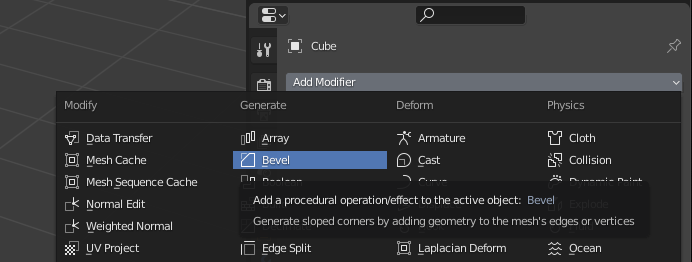

# Blender 4 N00bz

A super basic 1 hr introduction to working in 3D with Blender. If there's enough interest in moving forward, we can continue with sessions once a week covering different topics in greater detail.

### The Software

> Blender is [a cross-platform], free and open source 3D creation suite. It supports the entirety of the 3D pipeline—modeling, rigging, animation, simulation, rendering, compositing and motion tracking, even video editing and game creation. Advanced users employ Blender’s API for Python scripting to customize the application and write specialized tools; often these are included in Blender’s future releases. Blender is well suited to individuals and small studios who benefit from its unified pipeline and responsive development process.

## Overview

### Core Topics

1. Setup
1. Environment
1. Adding and Deleting Objects
1. Editing Objects
1. Modifiers

## Assumptions

1. You're pretty adept at using a computer.
1. You have some design experience with tools similar to Adobe Creative Suite.
1. You've never worked in 3D before, but have a basic understanding of 3D spaces (X, Y, Z axes and the like).
1. [You've already downloaded and installed Blender from here](https://www.blender.org/download/).

## Setup

When you first open Blender, you'll be able setup some basic configuration options:

* **Select** with **Left** mouse button
* **Spacebar** pops up the **Search** feature (play animation with shift+spacebar)
* I like to use the **Blender Dark** theme
* Click **Next** for more options

* You can leave these set to their defaults.
* Click **General** in the **New File** section to continue with the setup.

There are still a few things to configure before we get started.

* Click **Edit**
* Click **Preferences**

* Click the **Input** tab
* If you're not using a full keyboard with a number pad, check the **Emulate Numberpad** box.
* Check **Continuous Grab**
* Check **Release Confirms**

* Click the **Navigation** tab.
* Set **Orbit Method** to **Turntable**
* Check **Orbit Around Selection**
* Check **Perspective** in the **Auto** section

Save these to load as the default for all future projects.

* Click the Menu "hamburger" at the lower left corner of the window and click **Save Preferences**

## Environment

### The Default New Project File

When you open Blender, the default General file should load with a Camera, Cube, and Light.

These objects are presented in a Viewport window. We'll explore the viewport window more in a second. For now we'll focus on the objects.

### Objects

There are a few different kinds of objects in Blender:

* Lights
* Cameras
* Meshes
* Curves
* Surfaces
* Metaballs
* Text
* Empty Objects
* Force Fields
* and more!

In general, each object has an origin, location, rotation, and scale. Depending on the object type, it may also have other properties.

We'll focus on working with the basic objects given to us in our default General project and their specific properties.

#### Selection

* Use your left mouse button to click and select each of the objects, one at a time.
* Select the Camera then shift+click the Cube.

Notice how they're different colors. The last object you selected becomes the "active" object. This will become important when you are parenting objects together or sharing properties between them. More on this in future sessions. 

In the upper right corner of your screen, you can see the selection in the **Outliner**. The **Outliner** gives us a hierarchical view of all the Objects in our Scene.

#### Selecting using hotkeys

With as many features as Blender has packed into it, using hotkeys becomes absolutely essential. Return your cursor to the main Viewport and try the following:

* Press `command+i` (MAC) to select the inverse
* Press `a` to select all
* Press `option+a` (MAC) or `alt+a` (PC) to deselect all
* Click and drag to use box select to select all objects

### Changing Views

* Zooming can be done with the `+` and `-` keys.
* Rotating your view can be done with your laptop track pad.

When working in 3D it's helpful to switch between two different view modes:

* Perspective - Parallel lines converge in the distance. This is how we typically experience the world.
* Orthographic - Parallel line remain parallel. This allows for precise relative positioning. When working with geometry, orthographic view is prefered so that our squares are squares and so on.

The Viewport by default is in Perspective mode. We can switch to Orthographic view mode and between different view angles such as top, bottom, left, right, and camera using the numberpad, or the numbered keys when keypad emulation is enabled (like we did in the setup).

Try the following:

* Press `5` to switch to Orthographic View.
* Press `1` to view along the +Y axis (LEFT)
* Press `control+1` (MAC) to view along the -Y axis (RIGHT)
* Press `3` to view along the -X axis (FRONT)
* Press `control+3` to view along the +X axis (BACK)
* Press `7` to view along the -Z axis (TOP)
* Press `control+7` to view along the +Z axis (BOTTOM)
* Press `0` to view through the active camera

You can also use the GUI tools provided in your Viewport to change views:

## Editing

Blender is a fully featured 3D modeling tool. From base meshes, one can build anything. We'll cover some basic skills including:

* Deleting and Adding Meshes
* Basic Transformations
* Editing a base mesh
* Duplicating
* Linking
* Modifiers

### Deleting and Adding Meshes

* Select the **Cube** and press `x` to bring up the **Delete?** prompt
* Press enter to **Delete**

* Press `shift+a` to bring up the **Add** menu.
* Mouse over **Mesh**
* Mouse over and click **Cube**

We now have a new cube where the old one was.

Hint: type `shift+a` then `m` then `c` in sequence.

### Transformations: Translate, Rotate, Scale

Moving, rotating and scaling can be done in a number of different ways in a number of different places. I tend to use hotkeys over GUI for modeling when getting the general proportions set. If I have a specific dimension in mind, I'll enter changes into the GUI.

#### Translate

* Select the Cube
* Press `g` (think "grab") and move the mouse around
* Click the left mouse button to release.
* Not happy with where it landed? Press `option+g` to clear location transformations.

You can precisely move an object along a given axis too:

* Select the Cube
* Press `g`
* Press `x` to move along the X axis
* Type `1.5` and `enter` to move along the +X axis
* Press `z` and type `.5` and `enter`
* Press `y` and type `-1` and `enter`

#### Rotate

* Select the Cube
* Press `r` and move the mouse around
* Click the Left mouse button or press enter to confirm
* Try the pressing `r` twice.
* Use `option+r` to clear rotation transformations

You can precisely rotate an object about a given axis too:

* Select the Cube
* Press `r`
* Press `x` to rotate about the X axis
* Type `270` and `enter` to rotate about the +X axis
* Press `z` and type `-125` and `enter`
* Press `y` and type `15` and `enter`

#### Scale

* Select the Cube
* Press `s` and move the mouse around
* Click the Left mouse button or press enter to confirm
* Use `option+s` to clear scale transformations

You can precisely scale an object:

* Select the Cube
* Press `s`
* Type `2` and `enter` to scale from the object origin

You can scale an object along a given axis:

* Select the Cube
* Press `s`
* Press `x` to scale along the X axis
* Type `.5` and `enter` to scale along the +X axis
* Press `z` and type `.25` and `enter`
* Press `y` and type `1.5` and `enter`

#### Using the GUI

* Press `n` in the Viewport to expose the Transform Menu
* You can then manually enter values into any of the fields and press enter to confirm.

## Edit Mode

All the transformations above have bee performed on the mesh as a whole. A mesh is formed of vertices, between which edges are drawn, along which faces are formed. Let's edit the meshes directly.

* Press `command+n` and click **General** to load a new scene and discard our old one. Don't save the old one unless you really want to.
* Press `tab` to enter **Edit Mode**
* Press `option+a` to deselect all the verticies.
* You can select one at a time by simply clicking
* `command+click` to select multiple
* press `c` to do the same and press `esc` to confirm selection

### X-Ray Mode

To see verticies, edges, and lines through a mesh, you can toggle x-ray mode:

### Vertex, Edge, Face Select

You can toggle and combine the selection modes by clicking and shift clicking the modes in the upper left of the viewport when in edit mode:

### Extrude, Merge, Inset

We're going to make a crude crystal

* Use Face selection to select the top face of the Cube
* Press `e` for extrude and move you mouse to extrude the top face out

* Press `s` to scale down the face

* Press `e` and extrude upwards once more

* Press `m` for **Merge** and `a` for **At Center**

* Press `i` for Inset and move the mouse inwards a little

* Press `g` then `z` and move the inset face down a little

Sick! we have a funky little gem.

## Modifiers

It's not quite faceted enough for my liking. Let's use modifiers to change this base mesh.

* In the **Properties** window, click the **modifiers tab**

* Click **Add Modifier** and select **Bevel**

Sick! Now we have a funky little gem. Future sessions will cover making materials for this mesh and rendering it out. Let's save this for next time!

